# ⛰️ Monti

[](LICENSE)
[](#)
[](https://rclone.org)
[](https://tauri.app)

**Mount your clouds.** Your Google Drive, Dropbox or OneDrive becomes a normal
folder on your Linux desktop — open it in your file manager, edit files, save
them. No terminal, no config files, no sync folder eating your disk.

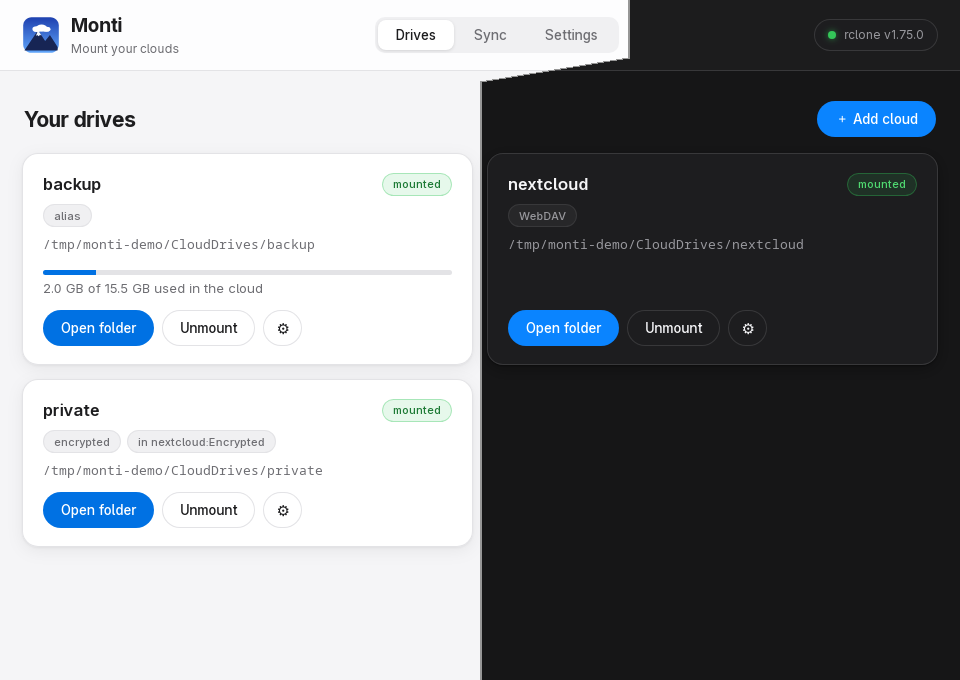

<sub>One window, both themes: Monti follows your desktop, or you pick.</sub>

*Monti* — from **mount**, and Italian for *mountains*: the place where clouds
come down to earth.

> Status: **early beta.** Linux only, by design. It works, and it is honest
> about what it does — but expect rough edges and please report them.

## The problem

Google has never shipped a Drive client for Linux, and the alternatives all ask
for something:

| | |
|---|---|
| **Sync clients** (Insync, overGrive) | download a second copy of everything onto your disk, and cost money |
| **The web interface** | no normal "open, edit, save" — you download, edit, re-upload |
| **rclone** | excellent and free, but it lives in the terminal: config wizards, mount flags, systemd units |

[rclone](https://rclone.org) already solves the hard part. What was missing is
a way to use it without becoming an rclone expert. That is Monti.

## What Monti does

- **Your cloud is a folder.** It appears in `~/CloudDrives/`, and every app —
  Dolphin, Nautilus, LibreOffice, KeePassXC — treats it like any other folder.
- **Or a folder that works offline.** A synced folder is a real copy on this
  computer, kept the same as a cloud folder in both directions — the Dropbox
  arrangement, for the times a mounted drive is the wrong tool.
- **Nothing is downloaded until you open it.** No full copy of your cloud on
  disk; files arrive when you actually open them.
- **Only the folders you want.** Tick the folders a drive carries — a 2 TB
  cloud does not have to arrive whole. The rest stays in the cloud, untouched.
- **An encrypted drive if you want one.** Files are encrypted here, names
  included, so the provider stores gibberish; you see your files.
- **Sign in through your browser**, the way you expect. Monti never sees your
  password.
- **Your drives survive quitting the app.** Close Monti and your folders keep
  working; it reconnects to its background engine on the next start.
- **You can see how full the cloud is** on every drive, and Monti says
  something before the cache fills your own disk.
- **It looks like the rest of your desktop** — light or dark, following your
  system settings, or whichever you pick.
- **In your language.** English, Ukrainian and Russian; it follows your
  desktop's locale, or you pick one in Settings. Messages coming straight
  from the engine stay in English — they are rclone's own words.
- **A speed limit** so a big transfer does not take the whole connection, and
  a list of what has been transferred.
- **It notices when a drive goes away** — unmounted from a terminal, or a
  mount that dies — and tells you instead of showing an empty folder.
- **It tells you the truth.** How much disk the cache is using, what a button
  is about to delete, when something is still uploading — and what the
  provider's error actually means, with its own words kept underneath.
- **A drive's folder is not a trap when the drive is away.** Save something
  into it while the drive is unmounted and it would land on your disk instead
  of the cloud — and block the next mount. Monti leaves that folder read-only
  until the drive is back, so the save fails instead of disappearing.
- **The tray does something.** Engine state at a glance, and one click to
  mount or unmount a drive without opening the window — plus *Unmount all*
  before you undock or suspend.
- **Start on login means the drives, not the window.** Monti comes up in the
  background; open it from the tray, or by starting it again.

## Screenshots

Every picture below is a real run — a WebDAV server, a local drive and an
encrypted drive on top of them. Light and dark alternate, because both are
the same build: Monti follows the desktop unless you tell it otherwise.

| | |
|---|---|
|  | **Your drives** — every cloud as a card: mounted or not, where it lives on this computer, how full the cloud is. The window is one build in two themes. |
| 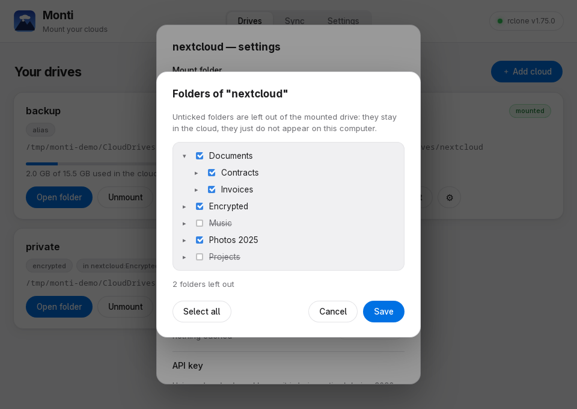 | **Only the folders you want** — tick what a drive carries. The rest stays in the cloud and never appears on this computer. |
| 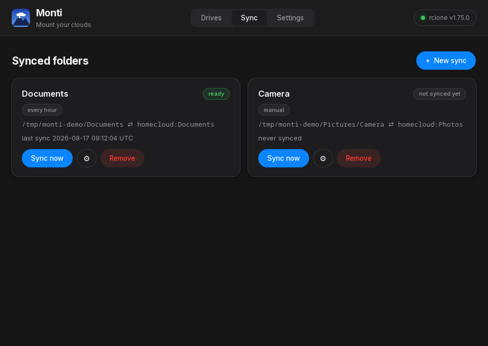 | **Synced folders** — a real local copy kept the same in both directions, for the folder you work in rather than the drive you browse. |
| 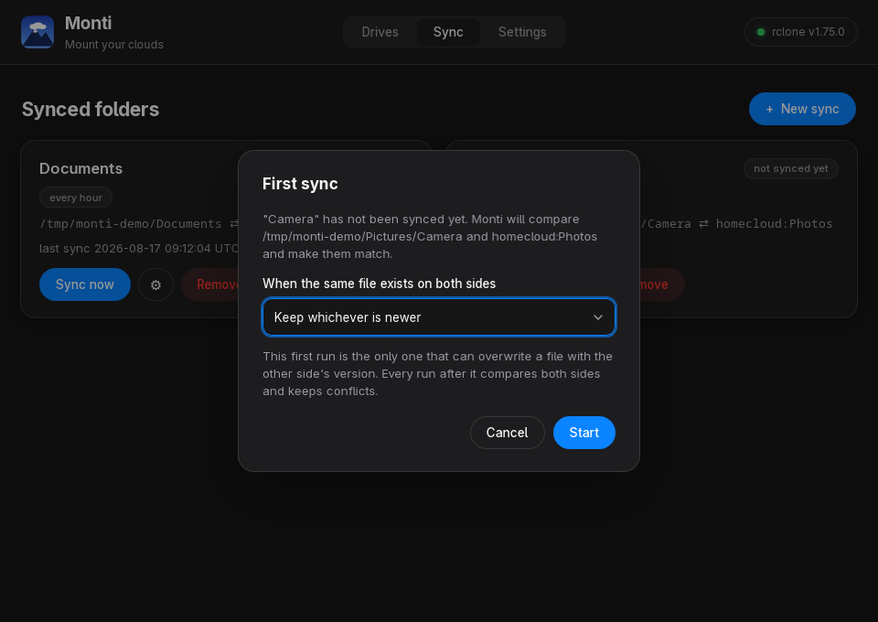 | **Before the first sync** — how much the cloud side holds and how much room is left here, and which side wins if a file exists on both. The first run is the only one that can overwrite. |
| 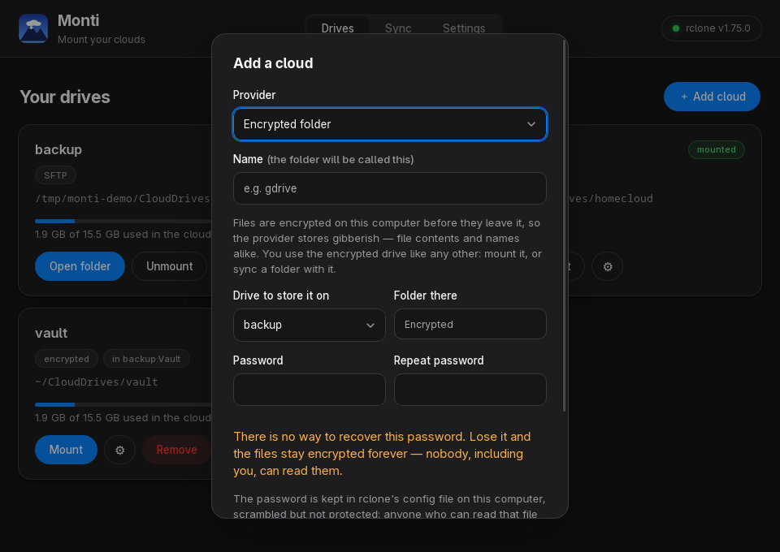 | **An encrypted drive** — stored inside a drive you already have. Contents and names are encrypted here, and the warning about the password is not in the small print. |
| 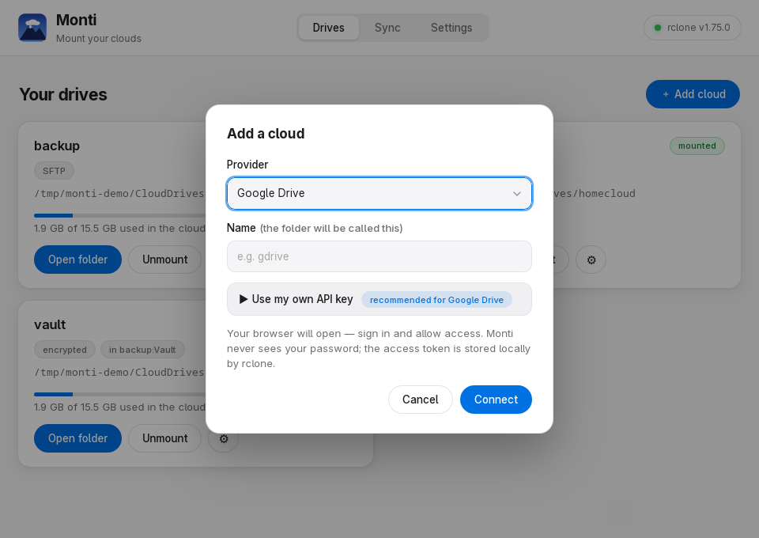 | **Adding a cloud** — pick a provider, give it a name, sign in. The API-key wizard is there when you want it, folded away when you don't. |
| 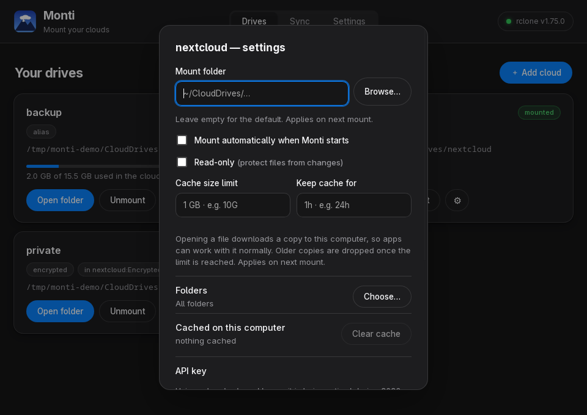 | **Per-drive settings** — where it mounts, whether it mounts on start, read-only mode, cache limit, which folders it carries, and how much it has cached right now. |
| 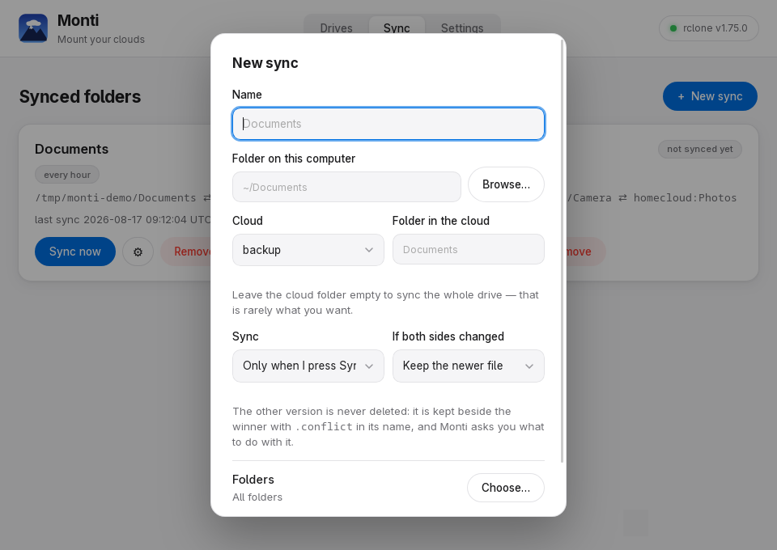 | **Setting up a sync** — a folder here, a folder in the cloud, how often, and what to do when both sides changed. **Browse…** opens your file manager's picker. |
| 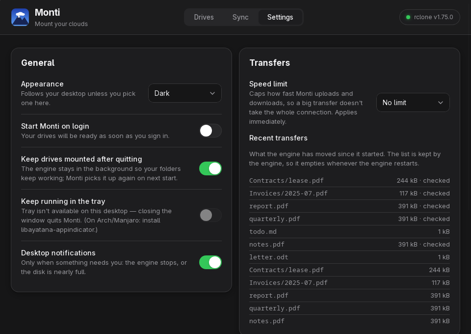 | **Settings** — theme, start on login, keep drives mounted after quitting, tray, notifications, a speed limit, and what the engine has moved since it started. |
| 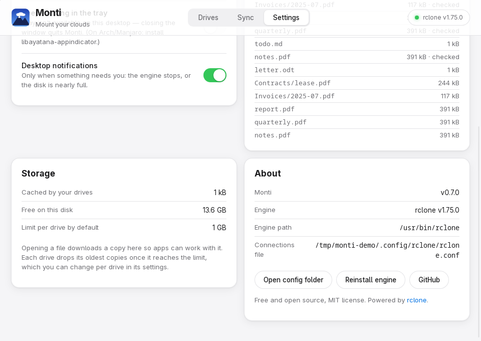 | **Storage** — what the cache costs you and how much room is left, because a cache that quietly fills the disk is the classic way rclone mounts go wrong. |
| 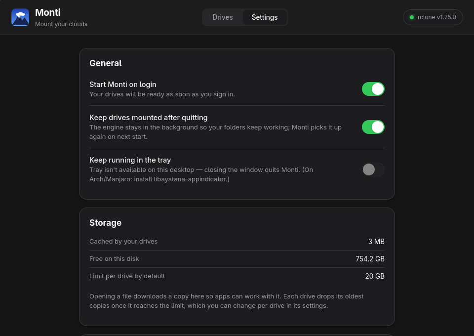 | **Removing a drive** — the dialog lists exactly what happens, including the folder it deletes, and lets you clear the cache in the same click. |

## Mount or sync?

Both are in Monti, and they answer different questions.

| | **Mounted drive** | **Synced folder** |
|---|---|---|
| Disk used | only what you opened | a full copy |
| Works with no network | no | yes, catches up later |
| Opening a file | downloads it first | instant |
| Scope | the whole drive | one folder |
| Can go wrong by | nothing — one copy | the same file changed in two places |

Rule of thumb: mount the drive you browse, sync the folder you work in.

Syncing runs while Monti is running — Monti is not a background service, and
the Sync screen says so rather than pretending otherwise. The first sync of a
pair asks which side wins if a file exists on both, because it is the only run
that can overwrite anything. After that, a file changed on both sides is never
resolved by deleting: the version that loses is kept beside the winner and
Monti asks what to do with it. A deletion is carried to the other side only
after you confirm it.

## Pain points this closes

Monti was built around the things that actually go wrong with rclone mounts:

- **The cache eating your disk.** Mounts need a full disk cache to let apps save
  files in place. Left unbounded, it grows until the disk is gone — the single
  most common rclone-mount complaint. Monti gives every drive a sane limit by
  default, shows the size on the card, and lets you clear it in one click.
- **Files that save "successfully" but never arrive.** Unmounting while uploads
  are queued is silent data loss. Monti checks before unmounting and before
  quitting, and says so plainly.
- **Drives disappearing when you close the window.** The engine runs
  independently, and Monti re-adopts it — after verifying it really is the
  process it left behind, not something else on the same port.
- **A dead engine looking like a broken cloud.** A health check spots it within
  seconds and restores every mount, with its exact options, on one click.
- **Two mounts of one remote corrupting files.** Monti refuses to double-mount,
  and shows mounts made outside itself instead of ignoring them.
- **Saving into a cloud folder that is not mounted.** The file goes to the
  local disk without a word, and the drive then refuses to mount over the
  folder it is sitting in. Monti keeps that folder read-only while the drive
  is away, so the save fails at the moment you make it.
- **rclone's shared API key being retired during 2026.** Monti walks you through
  creating your own key, including the test-user step that trips up most people.

## Install

One command, any distro:

```bash
curl -fsSL https://raw.githubusercontent.com/stektus/monti/main/install.sh | bash
```

It checks FUSE (offers to install it), downloads the latest release, verifies it
against the published checksums and adds Monti to your application menu.
Everything lands in your home directory — no root files touched.
Uninstall with `./install.sh --uninstall` (see [Uninstall](#uninstall)).

Prefer packages? Grab them from the
[latest release](https://github.com/stektus/monti/releases/latest):

| Package | For | On disk |
|---|---|---|
| `.AppImage` | any distro — `chmod +x` and run | ~80 MB |
| `.deb` | Debian, Ubuntu, Mint | ~18 MB |
| `.rpm` | Fedora, openSUSE | ~18 MB |

The AppImage carries its own copy of the desktop libraries, which is why it is
larger; the packages use the ones your system already has.

**On Arch, Manjaro or EndeavourOS** you can have a real pacman package instead:

```bash
git clone https://github.com/stektus/monti && cd monti/packaging/aur
makepkg -si
```

It repackages the release `.deb` and checks it against the checksums in the
`PKGBUILD`. (Not on the AUR: it is not accepting new maintainer accounts.)

### Uninstall

```bash
curl -fsSL https://raw.githubusercontent.com/stektus/monti/main/install.sh | bash -s -- --uninstall
```

It removes the app, its menu entry and the autostart file, then asks about
the two things worth a question:

- **App data** — the engine Monti downloaded, its logs and the list of synced
  folders (`~/.local/share/io.github.stektus.monti`).
- **Cached file copies** — what mounted drives kept on disk from the files you
  opened (`~/.cache/rclone/vfs`). It tells you the size first; these are
  copies, the originals are in your cloud.

It also clears the sync bookkeeping (`~/.cache/rclone/bisync`) and removes
`~/CloudDrives` **only if it is empty** — a mount folder with files in it is
left alone, because that is either not ours or something that never reached
the cloud. Your rclone config (`~/.config/rclone`) and everything in your
clouds are never touched.

Installed a package instead? Remove it the way you installed it, then run the
same script for the user-level leftovers:

```bash
sudo apt remove monti        # Debian, Ubuntu, Mint
sudo dnf remove monti        # Fedora, openSUSE
sudo pacman -R monti-bin     # Arch, from the PKGBUILD above
```

### Rather not pipe a script into bash?

Fair. Here is the same install by hand — the script does nothing else:

```bash
mkdir -p ~/Applications && cd ~/Applications
tag=$(curl -fsSLI -o /dev/null -w '%{url_effective}' \
      https://github.com/stektus/monti/releases/latest | sed 's|.*/||')
base=https://github.com/stektus/monti/releases/download/$tag
arch=$([ "$(uname -m)" = x86_64 ] && echo amd64 || echo aarch64)
curl -fLO "$base/Monti_${tag#v}_${arch}.AppImage"
curl -fLO "$base/SHA256SUMS"
sha256sum --ignore-missing -c SHA256SUMS   # must say "…AppImage: OK"
mv Monti_*.AppImage Monti.AppImage         # so the next version replaces it
chmod +x Monti.AppImage
./Monti.AppImage --version                 # prints the version and exits
```

To get it in the application menu, save this as
`~/.local/share/applications/monti.desktop` (with your own user name in
`Exec`):

```ini
[Desktop Entry]
Type=Application
Name=Monti
Comment=Mount your clouds
Exec=/home/YOU/Applications/Monti.AppImage
Icon=monti
Terminal=false
Categories=Utility;
StartupWMClass=monti
```

To remove it all: delete the AppImage, that `.desktop` file,
`~/.config/autostart/monti.desktop` and `~/.local/share/io.github.stektus.monti/`.

### What it needs

- **A desktop Linux with glibc 2.35 or newer** — Ubuntu 22.04+, Debian 12+,
  Fedora 36+, openSUSE Tumbleweed, Arch and derivatives. The installer checks
  and tells you if your system is older, instead of leaving you with a window
  that never opens.
- **FUSE3**, which rclone uses to mount drives. Preinstalled on most desktops;
  the installer offers to add it if missing.
- **x86_64 or arm64.** Every release carries both; the installer picks the
  right one.

The AppImage carries its own GTK and WebKit, and takes the C library, the
graphics stack and fonts from your system. Every release is launched on
**Debian 12, Ubuntu 24.04, Fedora 42 and Arch** before it is published, and is
rejected if the window does not draw.

If rclone is not installed, Monti downloads the official build into its own
folder; no root needed.

## If something goes wrong

**The window is blank / white.** Every release is launched on four
distributions before it is published, so this should not happen — if it does,
these two are worth trying, and either way please report it:

```bash
WEBKIT_DISABLE_DMABUF_RENDERER=0 ~/Applications/Monti.AppImage   # accelerated
WEBKIT_DISABLE_COMPOSITING_MODE=1 ~/Applications/Monti.AppImage  # last resort
```

**The window's close / minimise / maximise buttons do nothing.** A Wayland
bug in the windowing layer Monti is built on, not in Monti — double-clicking
the title bar usually wakes the buttons up, and starting Monti with
`GDK_BACKEND=x11 monti` avoids it entirely. It is fixed upstream
([tao#1218](https://github.com/tauri-apps/tao/pull/1218)); Monti picks the fix
up as soon as a Tauri release carries it.

**The file manager freezes for several seconds in a cloud folder.** It is
asking how much space is free, and that question goes to the provider. On
Google Drive through rclone's shared API key the answer can take fifteen
seconds or more, because that key is rate-limited for everyone using it —
measured on the same machine, the same provider: 0.3 s with an own key,
17 s with the shared one. Give the drive its own key (drive settings →
*Use my own API key*), which it needs before 2026 is out anyway. Turning off
*Show space information* in Dolphin's status bar settings stops the question
being asked at all.

**No tray icon.** Monti needs a StatusNotifier host and the appindicator
library. On Arch/Manjaro: `sudo pacman -S libayatana-appindicator`. Without it
the app still works — closing the window simply quits instead of hiding.

**A drive shows "mounted · system".** Something outside Monti mounted it — a
systemd unit or a manual `rclone mount`. Monti will not mount it a second time,
because two caches over one remote can corrupt files. Use that folder as it is,
or unmount it from the card and let Monti take over.

**"is mounted at … — unmount it first".** Removing a drive or clearing its cache
needs the mount gone first, so rclone is not reading files while they disappear.

**Logs** live in `~/.local/share/io.github.stektus.monti/`: `monti.log` for what
Monti did, `engine.log` for what rclone said. Neither contains passwords or
tokens.

## Something else is broken? Tell me

Monti is early beta and bug reports are the fastest way it gets better — most
of the fixes so far came from someone opening an issue.
**[Report a problem](https://github.com/stektus/monti/issues/new/choose)**, and
please include:

- your distro and desktop (e.g. *Manjaro, KDE Plasma 6, Wayland*) and the Monti
  version — `~/Applications/Monti.AppImage --version` prints it without
  opening the window;
- what you did, what you expected, what happened instead;
- the end of `monti.log` and `engine.log` from the folder above — and, for a
  window that never draws anything, the output of running the AppImage from a
  terminal, or `journalctl --user -b | grep -i monti`.

Logs hold no passwords or tokens, but they do contain your remote names and
file paths — trim anything you would rather not publish.

## How it works

```
┌────────────────────┐   JSON-RPC (localhost)   ┌──────────────┐
│   Monti (Tauri)    │ ───────────────────────▶ │  rclone rcd  │──▶ FUSE mounts
│  GUI + supervisor  │ ◀─────────────────────── │   (engine)   │──▶ cloud APIs
└────────────────────┘    status / progress     └──────────────┘
```

- Monti spawns `rclone rcd` (rclone's daemon mode) on a random port with random
  credentials and drives it over its JSON API. The credentials never reach the
  browser side of the app, and never appear in the process list.
- Mounts always run with `--vfs-cache-mode full`, because apps that save files
  in place (KeePassXC, office suites) corrupt them otherwise.
- The engine is a separate background process. With *Keep drives mounted after
  quitting* on (the default), closing Monti leaves your folders working; on the
  next start Monti verifies the daemon's identity — pid, start time and actual
  ownership of the port — before reconnecting or sending anything to it.
- OAuth happens in your browser through rclone's own flow, driven over the API
  so no engine restart is needed and no drive gets dropped mid-setup.

## Supported clouds

Google Drive, Dropbox, Box, pCloud, Yandex Disk, MEGA, Proton Drive, OneDrive
(experimental), Backblaze B2, and self-hosted storage: WebDAV / Nextcloud,
S3-compatible, SFTP.

On top of any of them you can add an **encrypted drive**: file contents and
file names are encrypted on this computer, so the provider stores gibberish
and only you can read it. Two things are worth knowing before you make one —
both are in the dialog as well:

- **A lost password cannot be recovered.** Not by Monti, not by the provider.
  The files stay encrypted forever.
- **The password is stored on this computer** in rclone's config, scrambled
  but reversible. What encryption protects is the copy in the cloud, not the
  config file on your disk.

## Roadmap

- [x] Own OAuth client-id wizard (rclone's shared key is being retired in 2026)
- [x] Per-drive cache limits, read-only mode, cache cleanup
- [x] Transfer activity indicator and engine health recovery
- [x] WebDAV, S3-compatible, SFTP, Backblaze B2, MEGA and Proton Drive support
- [x] One-command install script with checksum verification
- [x] Cloud storage quota on each drive card
- [x] Bandwidth limit, transfer history and desktop notifications
- [ ] AUR package — waiting on the AUR to accept new accounts again
- [x] arm64 builds
- [x] Two-way sync (bisync) with a conflict-resolution UI
- [x] Selective folders — choose what a drive or a synced pair carries
- [x] Encrypted drives (rclone crypt) with an honest warning about the password
- [x] Translations — Ukrainian and Russian, with a place for more
- [ ] More providers (Koofr, Jottacloud, Storj, …)

## Building from source

Prerequisites: [Rust](https://rustup.rs), Node.js ≥ 20, and Tauri's Linux system
dependencies:

- Arch/Manjaro: `sudo pacman -S --needed base-devel webkit2gtk-4.1 libayatana-appindicator`
- Debian/Ubuntu: `sudo apt install build-essential libwebkit2gtk-4.1-dev libssl-dev librsvg2-dev libayatana-appindicator3-dev patchelf`

```bash
git clone https://github.com/stektus/monti.git
cd monti
npm install
npm run tauri dev      # run in development
npm run tauri build    # .AppImage / .deb / .rpm in src-tauri/target/release/bundle/
```

## Contributing

The most useful thing anyone can send is a bug report — Monti is early beta,
and most of what works today works because someone said it did not. "This
screen confused me" is a report as well; so is trying a provider on hardware or
a desktop nobody here has.

Want to touch the code? [CONTRIBUTING.md](CONTRIBUTING.md) has the layout, the
checks to run before a pull request, and the handful of rules that are not up
for debate — no secrets on a command line being the first of them.

## License

[MIT](LICENSE). Monti is an independent project, not affiliated with rclone or
any cloud provider.
